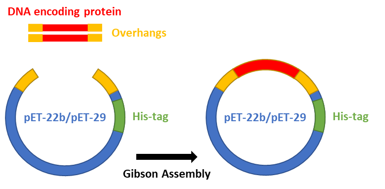
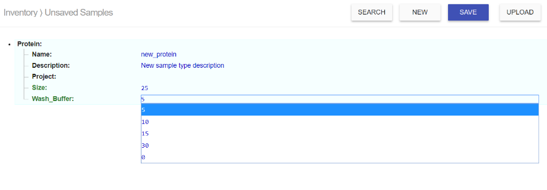

# About this workflow

**Protein Purification Workflow**

Introduction
============

Basic Concept
-------------

The protein purification in this workflow is based on the selectivity
and affinity from a protein which has been tagged with six consecutive
histidine residues (His tag) to nickel-nitrilotriacetic acid (Ni-NTA)
metal-affinity chromatography matrices. Poly-histidine tagging provides
an economic and robust way to obtain a protein of interest for
downstream researches.

Operations and Features
-----------------------

This workflow provides a complete system for the cloning, expression,
purification, and detection of His-tagged proteins. Operations available
to reach this goal can be bundled into 4 main categories:

### Cloning of Insert Containing Gene of Interest into pET Vector

The first category contains cloning steps. This cloning section
addresses the steps including the design of the construction,
preparation of insert and vector DNA, ligation with Gibson assembly,
transformation, and identification of clone that express the desired
protein (see the example in section 2.3.2). Once you have a bacterial
clone that expresses a His-tagged protein, the experiment can proceed
with expression, purification, and identification of His-tagged proteins
in the next categories.

### Induction of Protein Expression in BL21DE3 Competent Cell

The second category includes operations as follows: *Make a Starter*,
*Make Overexpression*, *IPTG Induction*, and *Harvest Cell*. The purpose
of this step is to induce the expression of recombinant proteins encoded
by pET vector which could be rapidly induced by the addition of
isopropyl-β-D-thiogalactoside (IPTG).

### His-tagged Protein Purification

This category includes *Column Packing*, *Lyse Cell, His-tagged
Purification,* and *Concentrate Protein*. In the operation of *Lyse
Cell*, a cleared lysate from *E. coli* cell pellet is generated by
sonication and high-speed centrifugation. This cleared cell lysate is
then applied to an affinity column in the operation of *His-tagged
Purification*. Depending on the affinity of the His-tag toward the
Ni-NTA, the desired protein can be purified under native condition.
Imidazole competes with the His tag for binding to the Ni-NTA, and thus
is used for elution of the desired protein.

### Protein Identification

The final category contains *SDS-PAGE Sample Preparation, SDS-Gel
Casting, SDS-PAGE Analysis,* and *Scan Gel*. Protein separation by
SDS-PAGE can be used to estimate the relative molecular weight and to
determine the relative abundance of purified protein. The purity of
protein samples can also be assessed with the gel image stained by a
Coomassie stain reagent.

Overview
========

Schematic Diagram of the Workflow
---------------------------------

 Timeline and Experiment Duration
--------------------------------

-------------------------------------------------------------------------------

Designing a Plan
----------------

The following are general guidelines for using this workflow.

### Start a new plan

You need to create a new protein sample before starting a new plan. To
create a new sample, click *SAMPLES* in the Aquarium main menu, and then
click the *NEW* button to select "Protein" in the sample type. Make sure
you enter protein size (in molecular weight, kDa) which will be used in
protein identification in SDS-PAGE analysis. The system will also ask
you to select a concentration (mM) of the wash buffer that applies to
the operation of *His-tagged Purification* for washing out non-specific
binding.

### Start with a DNA fragment of interest

Start from *Make PCR Fragment* to add overhangs on DNA fragment with
designed primers. Run PCR product and digested pET vector on an agarose
gel to check size and yield, and then apply them in Gibson assembly
reaction. Sequence the plasmid DNA to verify the clone (see the example
shown below). Once you have the plasmid DNA ready, you can proceed to
transform it into BL21DE3 competent cell to start the purification
workflow (see the example in section 2.3.3).

### Start with a DNA of interest that are already cloned to pET vector

You can start from *Transform Cells* with BL21DE3 competent cell, and
then continue the purification workflow (see the example shown below).

### Start with a glycerol stock of transforming BL21DE3 with plasmid DNA

You can directly start from *Streak E. coli Plate*, *Check Plate*, *Make
a Starter* and then continue to go through a protein purification
workflow.

Results of Test Run
===================

To test this workflow, we used three plasmid DNAs by courtesy of David
Younger. The DNA fragment of interest has already cloned to a pET29b
vector (shown in 3.1). The plan was started from transformation in
BL21DE3 competent cell (shown in 3.2). After eluting protein samples
from Ni-NTA resin, we did buffer change with PBS, and concentrated
protein sample volume to 1 mL, keeping protein sample in high
concentration to prevent it from decaying, then determined the protein
concentration (shown in 3.3). The protein expression and purity were
verified by SDS-gel image (shown in 3.4). In the gel**, every three
wells form a data set for one batch (shown 1.2.4), which are the
proteins (well order from left to right) before IPTG induction, after
IPTG induction, and after purification. In all three purifications, very
little protein was observed at the expected size without induction as
compared to a significant amount of protein after induction and a
significant enrichment of the desired protein after purification. The
first two purified proteins have high purity while the last sample,
SpyTag-Snoopcatcher, has some non-specific protein in the purified
sample. It might just need a slightly higher concentration of imidazole
in wash buffer (such as 15 or 30 mM) to remove this non-specific
protein. Users have the control of selecting the parameter of wash
buffer concentration to get a better result (show in 2.3.5).**

Samples
-------

Plans
-----

### Select BL21DE3 competent cell and plasmid of interest as inputs

### Select protein item as an output

### Select Qiagen Ni-NTA for column packing, then save and launch the plan.

Concentration
-------------

> Protein concentration determined by NanoDrop

SDS-Gel Image
-------------

Operating Requirements
======================

 Equipment
---------

High-Speed Centrifuge

Refrigerated Centrifuge

Small Benchtop Centrifuge

PCR Machine

Nano-Drop

Incubator Shaker

Digital Dry-Bath Heat Block

Lab Support Stand with Clamps

Sonicator

Laboratory Scales

Stir Plate

Electrophoresis Power Supplies

Mini-PROTEAN® Tetra Handcast System

 Materials and Chemical Reagents
-------------------------------

Ni-NTA Agarose

BL21DE3 Competent Cell

LB Agar Plate with Antibiotics

TB medium

IPTG

Protease Inhibitor, EDTA-Free

Imidazole

PBS, pH7.4

Sodium Phosphate Dibasic, Na2HPO4

Sodium Phosphate Monobasic, NaH2PO4

Sodium chloride, NaCl

Trition X-100

2x Laemmli Sample Buffer

DI water, sterilized

Gibson Master Mix

Resolving Buffer

Stacking Buffer

30% Acrylamide/Bis Solution, 29:1

10% SDS Buffer

TEMED

Ammonium Persulfate (APS)

10x Tris / Glycine / SDS

Protein Ladder

Gel Staining Reagent

 Laboratory Supplies
-------------------

Pipettor and Tip

Racks

Electroporation Cuvettes

Falcon Tubes 50mL / 225mL

Disposable Plastic Cuvettes

Disposable Gravity Flow Column with Adaptors

Concentrator

2L Erlenmeyer Flask

Serological Pipette

Disposable Droppers

Beakers

Gel Loading Tip
